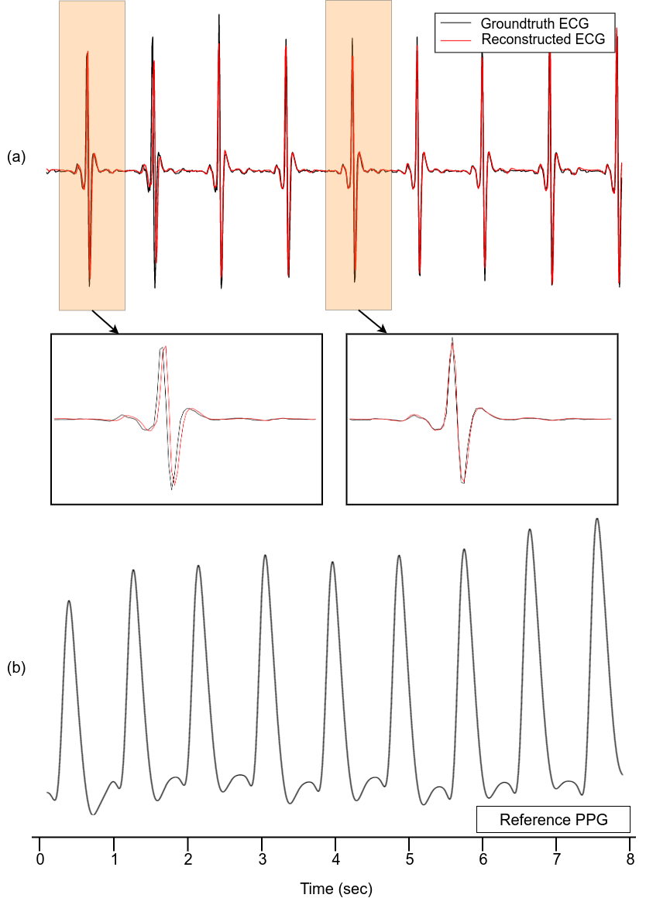

# PPG2ECG
The official implementation of the paper "Reconstructing QRS Complex from PPG by Transformed Attentional Neural Networks"

## Results
Graph Abstract


Model Architecture


Reconstruction Visualization


## Dataset
Download the dataset:
https://drive.google.com/file/d/15dxbpi4FH7lJbRFZwyREyX4V0VKDxXNs/view?usp=sharing

And follow the instruction:
```bash
mkdir data
unzip dataset.zip -d data
```

After that, you should have following data structure:
```bash
data/
├── bidmc
│   ├── bidmc_csv
│   ├── bidmc-filtered
│   ├── bidmc-filtered-test
│   └── bidmc-filtered-train
└── uqvitalsigns
    ├── uqvitalsignsdata
    ├── uqvitalsignsdata-test
    └── uqvitalsignsdata-train
```

## Pretrained Model (UQVIT)
Download the model weights and usually we put it in `./weights`.
https://drive.google.com/file/d/10aYWNkgaGCz1zU6--kN3yaW6L_9BzkhQ/view?usp=sharing

## Environment
You can check it yourself in requirements.txt
- Ubuntu 18.04
- python 3.6
- pytorch 1.2
...

## Installation
```bash
# in your environment with pip
pip install -r requirements.txt
```

## Usage
All the training parameters are included in config files.
```bash
# run UQVIT dataset with full model
python3 train.py --flagfile config/UQVIT.cfg

# run UQVIT dataset with LSTM baseline model
python3 train.py --flagfile config/UQVIT_LSTM.cfg

# run BIDMC dataset with full model
python3 train.py --flagfile config/BIDMC.cfg
```

## Test for your own PPG data
Please see [EXAMPLE.md](doc/imgs/EXAMPLE.md).

## Tensorboard
```bash
tensorboard --logdir logs
```

## Citation
If you use this code for your research, please cite our papers.
```
@Article{ppg2ecg,
author={Hong-Yu, Chiu
and Hong-Han, Shuai
and Paul C.-P, Chao},
title={Reconstructing QRS Complex from PPG byTransformed Attentional Neural Networks},
journal={},
year={2020},
month={},
volume={},
number={},
pages={},
}
```