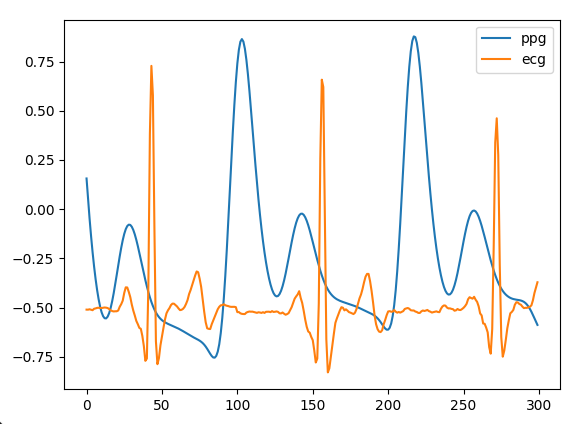

# Example
It is a small example to show how to transfer ECG from PPG with a pretrained model.
The detail is in `./inference.py`.

## Run
Download the pretrained weights from UQVIT dataset.
Put it in `./weights`.
https://drive.google.com/file/d/10aYWNkgaGCz1zU6--kN3yaW6L_9BzkhQ/view?usp=sharing

```bash
python3 infernece.py --weights weights/model_best.pth
```

## Prepare your own PPG data
You need to preprocess your data before feeding in the model.
1. The input size should be [1, 200] (1 representing the feature dimension and 200 means 2 seconds with sampling rate 100Hz)
2. The input data range should be [-1, 1] (Be careful for the outliers)
3. In pytorch, the input data needs batch dimension, so the final shape should be [1, 1, 200] ([batch, feature, length])

## Tips
The model will perform better in the middle range of input data due to the convolution property. So we recommend to make a running window with step=100 to inferece.

For example, if we have a PPG data which has the length of 500, we should inference the data index by [0, 200], [100, 300], [200, 400], [300, 500]. And we extract the middle range of them by [50, 150] + [150, 250] + [250, 350] + [350, 450] to reconstruct the whole ECG.

## Result
Simple result from ./example/PPG.npy
